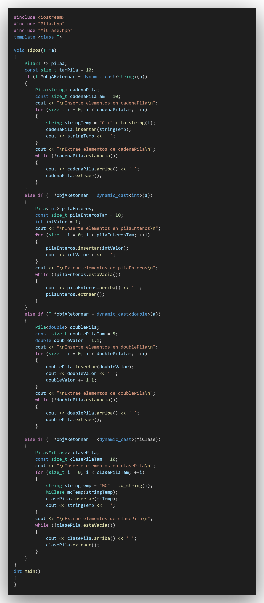

## :copyright: Autor

- :camera: 

- :man: **Daniel Morales**
- :e-mail: danielaugustoma@unitec.edu
- :link: [https://github.com/D11110](https://github.com/D11110)
- :calendar: 2020-09-06 23:00 CST

---

## :dart: Objetivos

Punto de control de **C++** #07:

:blue_book: En este se vieron temas como:
   - **herencia**
   - **polimorfismo**
   - **plantillas**

---

## :black_circle: Pila.hpp

---

## :triangular_ruler: MiClase.hpp

---

## :white_large_square: plantillas.cpp

---

## :computer: Código

- :blue_book: [C-_PDC_-06](https://github.com/D11110/C-_PDC_-06)

---
#### Herramientas:
- :package: [Visual Studio Code](https://code.visualstudio.com/)
- :camera: [Polacode-2020 v0.5.2](https://github.com/jeff-hykin/polacode)
- :notebook: [Markdown Cheatsheet](https://github.com/adam-p/markdown-here/wiki/Markdown-Cheatsheet)
- :smile: [Emoji Cheat Sheet](https://www.webfx.com/tools/emoji-cheat-sheet/)